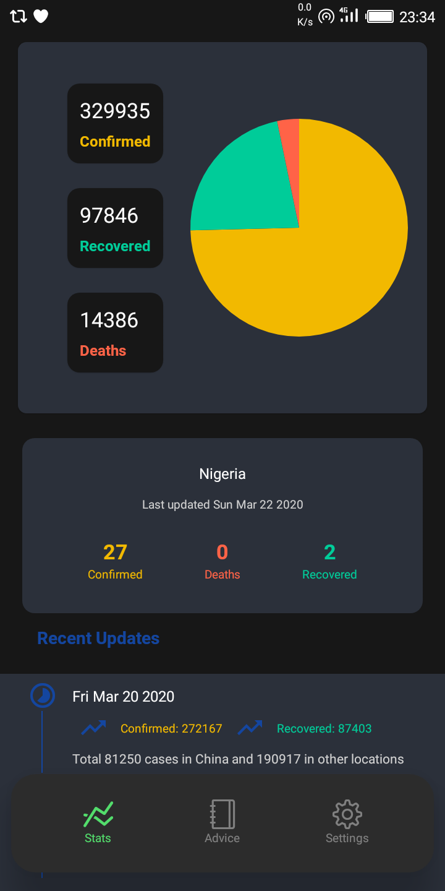
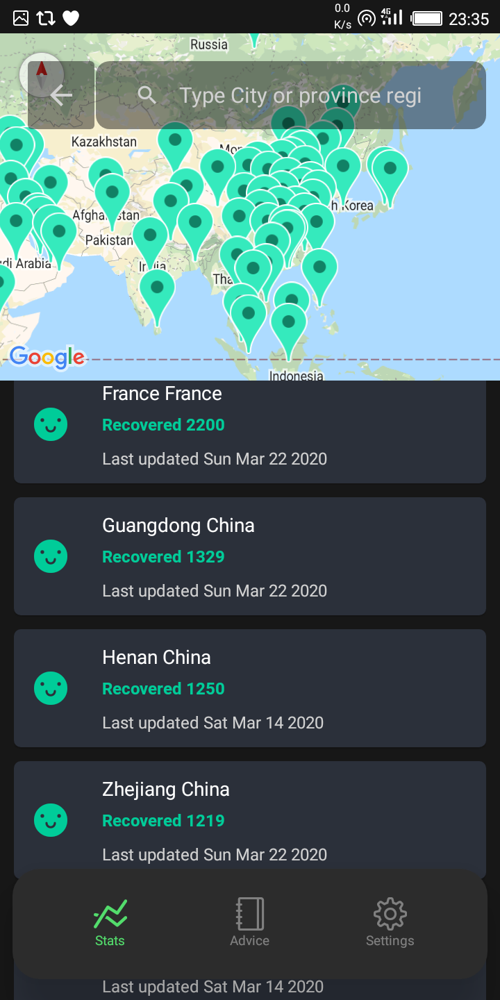
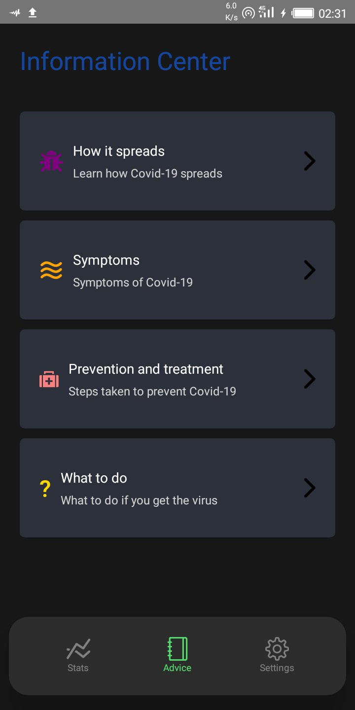

# 📱 Vironator (Virus Monitor)

A React Native app created to track COVID-19 cases and also provide users with important information. 
The information we provide is collated verified and reputable institutions such as World Health Organization (WHO), the US Centers for Disease Control and Prevention (CDC), 
the Chinese Centre for Disease Control and Prevention (ECDC) and the Nigeria Center for Disease Control (NCDC).

# ⬇ Download Now !
https://drive.google.com/file/d/15QFX5BbHk5dYeUjijdsccI2x_MpBgg1O/view

# ⚙ Features
- See all cases statistics
- Get latest updates from trusted sources
- Global hotlines

# 🧾 To-Do List
- Curate global hotlines
- Get latest updates from verified sources 

# 📸 Screenshots

&nbsp;

&nbsp;

Ps: Ignore the glitchy GIF, the app is much sleeker, trust me 😉

# 🤓 Contributor(s)
- Joseph Olabisi 
- Oyefeso Oluwatunmise 

# 🧾 License - MIT License
Copyright (c) 2020 Vironitor - Released under the <a href="https://github.com/Blac-Panda/react-native-covid19/blob/master/LICENSE.txt">MIT license.</a>
